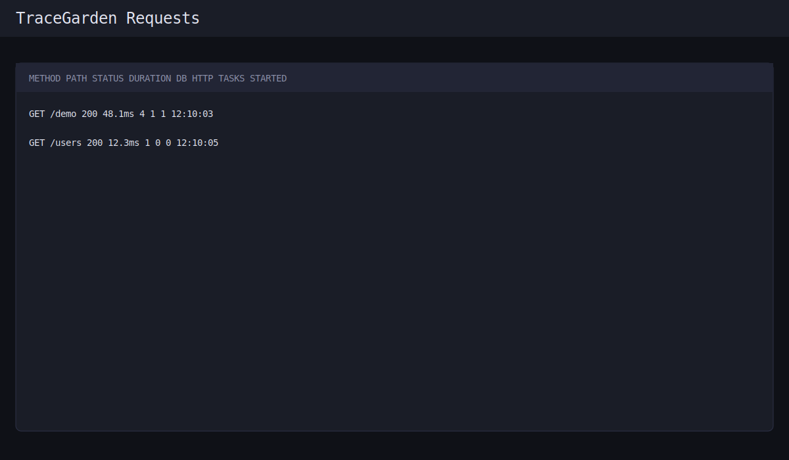
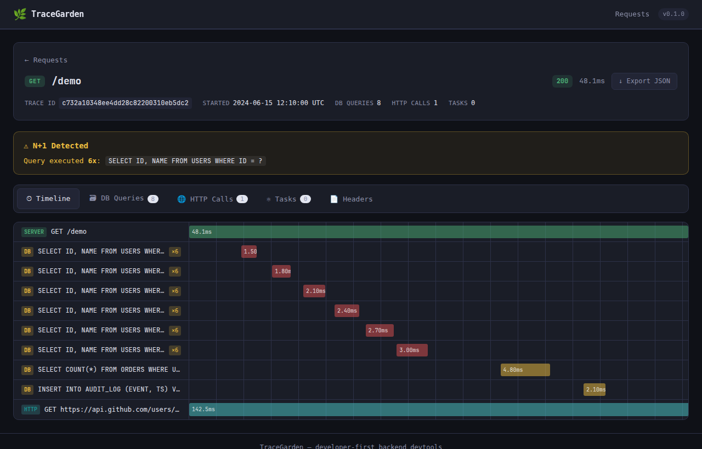

<p align="center">
  
</p>

# TraceGarden

Developer-first visual backend devtools for Django, Flask, and FastAPI.

TraceGarden captures request timelines (DB + HTTP + spans + Celery) into local SQLite and serves a built-in UI at `/__tracegarden`.

## Features

- WSGI + ASGI support (`Django`, `Flask`, `FastAPI`)
- OTel-native span ingestion into local TraceGarden UI
- DB query fingerprinting, grouping, duplicate and N+1 detection
- Outgoing HTTP inspector (`requests` / `httpx`)
- Celery stitching (`web request -> queued task -> worker state`)
- Trace bundle export (single JSON artifact)
- Development guardrails: redaction by default + UI token protection

## Installation

```bash
pip install tracegarden
# extras
pip install tracegarden[django]
pip install tracegarden[flask]
pip install tracegarden[fastapi]
pip install tracegarden[celery]
```

## Quick Start

### Django (one app + one middleware)

```python
# settings.py
INSTALLED_APPS = [
    ...,
    "tracegarden.integrations.django",
]

MIDDLEWARE = [
    "tracegarden.integrations.django.middleware.TraceGardenMiddleware",
    ...,
]

TRACEGARDEN = {
    "enabled": True,
    "ui_token": "dev-secret",
    "ui_token_header": "X-TraceGarden-Token",
    "ui_prefix": "/__tracegarden",
}

# urls.py
from tracegarden.ui.routes import mount_django_urls
urlpatterns = mount_django_urls() + urlpatterns
```

### Flask (init extension)

```python
from flask import Flask
from tracegarden import TraceGarden

app = Flask(__name__)
TraceGarden(app, ui_token="dev-secret")
```

### FastAPI (one middleware)

```python
from fastapi import FastAPI
from tracegarden import TraceGarden

app = FastAPI()
TraceGarden(app, ui_token="dev-secret")
```

## UI Access

Default route: `/__tracegarden/`

Pass token using one of:
- header: `X-TraceGarden-Token: dev-secret`
- query param: `?token=dev-secret`
- cookie: `tg_token=dev-secret`

## Screenshots




## OpenTelemetry

```python
from tracegarden.otel.setup import setup_otel

setup_otel(
    service_name="my-api",
    also_export_to_tracegarden=True,
)
```

## What gets recorded

See [docs/WHAT_IT_RECORDS.md](docs/WHAT_IT_RECORDS.md).

## End-to-end examples

See [examples/README.md](examples/README.md).

## License

MIT
